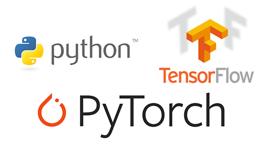
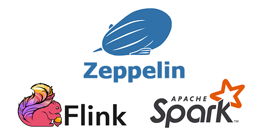

<!--
Licensed under the Apache License, Version 2.0 (the "License");
you may not use this file except in compliance with the License.
You may obtain a copy of the License at

http://www.apache.org/licenses/LICENSE-2.0

Unless required by applicable law or agreed to in writing, software
distributed under the License is distributed on an "AS IS" BASIS,
WITHOUT WARRANTIES OR CONDITIONS OF ANY KIND, either express or implied.
See the License for the specific language governing permissions and
limitations under the License.
-->


  

    <h2>Technologies</h2>
    

      

        

          <label class="_default-text" style="margin-top: 20px;">
            
          </label>
          <label class="_hover-text">
            

              Submarine supports Yarn, Kubernetes, Docker with Resource Scheduling.
            

            <a href="/docs/0.7.2/interpreter/spark.html" class="panel-button">USE NOW </a>
          </label>                     
        

      

       

         

           <label class="_default-text" style="margin-top: 20px;">
             
           </label>
           <label class="_hover-text">
             

               Submarine supports Python, Tensorflow, PyTorch with machine learning algorithm development.
             

             <a href="/docs/0.7.2/interpreter/spark.html" class="panel-button">USE NOW </a>
           </label>
         

       

      

        

          <label class="_default-text" style="margin-top:20px;">
            
          </label>
          <label class="_hover-text">
            

              Submarine workbench supports Spark, Flink with data processing and model prediction processing.
            

            <a href="/docs/0.7.2/interpreter/python.html" class="panel-button">USE NOW </a>
          </label>
        

      

    

    

      

        See more details in Submarine more feature.
        <a href="/docs/0.8.0-SNAPSHOT/manual/interpreters.html">LEARN MORE </a>
      

    
    
    

    

      <h2 style="padding-bottom: 8px;">Deployments</h2>
      

        

          <label style="width: 100%;">
            

              
              Single User
            

          </label>
          <label class="content-text">
            Local Spark, 6 Built-in visualizations, Display system, Dynamic form, Multiple backends are supported. 
            <a href="/docs/0.7.2/install/install.html" class="user-button">LEARN MORE</a>
          </label>
        

      

      

        

          <label style="width: 100%;">
            

              
              Multi-User
            

          </label>
          <label class="content-text">
            Zeppelin supports Multi-user Support w/ LDAP. Let's configure Zeppelin for your yarn cluster. 
            <a href="/docs/0.7.2/security/shiroauthentication.html" class="user-button">LEARN MORE</a>
          </label>                 
        

      

    

  

